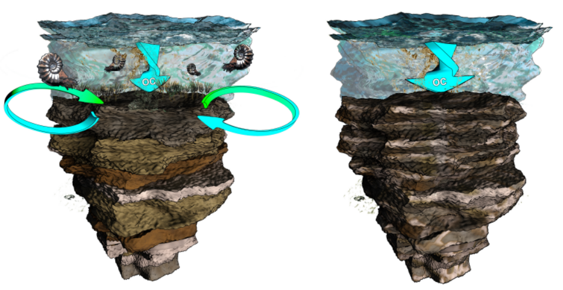

---

<h2 style="text-align:center;", title="datamanagement">
Data management</h2> 

<i>
**Safeguarding data for the future.**
</i>

Data management and subsequent downstream recycling of data is increasingly seen as a primer for future innovation and new discoveries. Above all, good data management practices are critical to open science and an inclusive, connected worldwide academic community—providing opportunities for developing countries that do not have the same resources for data generation as wealthy countries.

Solutions for better data management infrastructures, such as formalised in the Findable, Accessible, Interoperable, and Reusable (FAIR) data guiding principles [@Wilkinson2016], are an active, yet developing field of research. Hence, researchers in every stage of their career; from beginning PhDs to a professor running a large research group, have either only limited knowledge of good data management and open science practices, or do not have the capacity to invest time and resources in familiarising themselves with current developments in this field.

The task of optimizing data management infrastructures can be especially daunting for laboratories populated by a range of analytical instruments—each with their own vendor supplied software suite for data processing, analysing, and diagnostics. The wealth of commercial analytical instruments results in various data models which are not easily integrated. This so-called “vendor lock-in” further prevents transparency of the workflow from raw to analysed data.

Low-level access to raw data and insights in workflows is not necessary for all scientist, but it can be important for special purpose research questions and the reproducibility of published research. On top of that, many disciplines of natural sciences rely on field observations and on-site experiments besides laboratory output. All this data should ideally be standardized, integrated, and managed at one central point throughout the life cycle from raw, analysed, published to archived data.

The **integrated lab** is a solution to centralize data management of the traditional unconnected lab by collecting and harmonizing data streams from various lab instruments, and by providing open-sourced alternatives for routine analytical workflows. The tool [panacea](https://github.com/FAIReLABS/panacea) is an attempt to realize this goal.

---

<h2 style="text-align:center;", title="diagenesis">
Carbonate diagenesis and stratigraphy</h2> 

<i>
**What can we learn about rock chronology by studying the carbon isotope composition of rock?**
</i>

A prime task for geologist is assigning an age to rock samples (<http://www.stratigraphy.org>). A well constrained rock chronology will not only give a better grasp on the age of certain sedimentary deposits or fossils, it provides an understanding of the timescale at which processes acted that shaped the planet and enabled the evolution of life. A plethora of techniques exist to determine the age of rock, some directly translating into absolute ages (e.g. a rock sample of 4.21 million year ago), other techniques result in a relative understanding of the chronological position of a rock.
 

Stable carbon-isotope composition of calcium carbonate rock recorded as stratigraphic excursions or trends---in terms of the ratio of the lighter C-12 to heavier C-13---can be used to approximate the rough age of a lithological succession [@Tong2007; @Korte2010a]. Such isotope chemical stratigraphic framework provides a means to piece together a mosaic of successions found around the globe.
  

An important assumption when using isotope chemical records is that they record a globally universal signal of marine water chemistry and changes therein, unfolding over timescales of thousands to millions of years [@Veizer1999]. However, we know for a fact that processes that facilitate the lithification of carbonate sediments can alter the original chemistry [@Marshall1992]. As such, the question boils down to what extent do such post-depositional processes alter the primary chemical signal?
  

With this question in mind, I considered the contribution of microbial life within sediments, and how metabolism of microbes affects their immediate surroundings [@Schobben2016]. For instance, the biochemical processes that provide a cell with energy during photosynthesis discriminates against the energetically unfavourable heavier C-13, and preferentially takes the lighter C-12 from their surroundings  [@Farquhar1989]. Reversed the destruction of these organic compounds---organic matter remineralization by heterotrophic organisms---again releases these light carbon isotopes (C-12) to the environment [@Irwin1977].
   

Cycling of carbon within sediments is governed by a multitude of microbial organisms, which live at defined depths within the sediment [@Berner1964; @Froelich1979]. Moreover, these organims have a differential effect on the chemistry of their immediate surrounding, i.e. the porewaters of the sediments but also on minerals forming from these so-called "diagenetic solutions". This led me to propose that these organisms might leave a distinct imprint superimposed on the primary carbon isotope signal of calcium carbonate, i.e., distorting the isotope chemistry initially channelled from the overlying watercolumn to the sediments.
   

Carbon isotope scatter at confined centimetre stratigraphic scale appears to represent exactly this signal of microbial activity. A numerical model could further prove that the observed signal of isotope variability can be created by microbial activity and by using existing knowledge of these microbes as parameters for this model.
   

This study might be perceived as negatively impacting our capability of constraining the chronology of ancient sediment successions. However, I could show that such carbon isotope records still contain a distinct primary isotope imprint. In addition, the exercise shows that this chemical record contains more information besides marine chemistry, it also covers biological contributions from sediment dwelling microbes. These organisms are important geobiological agents of the global carbon cycle.
   

Click [here](https://github.com/MartinSchobben/carbonate) for the R scripts and data used in these studies, to recreate figures and models. 

<i>   
The cartoon sketches the two opposing scenarios; a pre-extinction ocean with benthic communities mixing the upper layer of sediment causing organic matter to be evenly dispersed, and the post-extinction situation were sediment are less mixed due to the absence of metazoans (artwork by Mark Schobben;   <http://cyarco.com>)
</i> 

---

<h2 style="text-align:center;">
Strangelove oceans vs. living oceans
</h2>

<i>
**Are periods of major marine biodiversity-loss the result of biological growth gone haywire?**
</i>

Life on Earth experienced several evolutionary bottlenecks—mass extinctions—hallmarked by a severe reduction of the diversity of life, and leaving behind a completely altered fauna, distinct from its predecessor [@Sepkoski1981]. Undoubtedly, the most famous faunal turnover occurred at the end of the Cretaceous with, most notable, the demise of non-avian dinosaurs [@Alvarez1980]. 

From an oceanic perspective it is often argued that the collapse of primary producers initiated the decline of marine organisms in higher trophic levels, i.e., removing the fundament of the trophic pyramid [@Hsu1985]. In the case of the end-Cretaceous mass extinction, blocking of sunlight and consequential obstruction of photosynthesis is regarded to have been triggered by atmospheric dust injections resulting from an extraterrestrial bolide colliding with Earth [@Alvarez1980; @Renne2013]. 

Contrary to the end-Cretaceous example, cited above, some marine biotic disturbance might have been initiated by a reversed scenario of increased primary production which perturbed the system by trigerring lethal feedbacks. For example during the end-Permian biotic crisis, adverse marine conditions associated with large areas of oxygen depleted and hydrogen sulfide enriched water are considered as main stressors for eukaryotes during this time interval[@Joachimski2001; @Wignall1996; @Meyer2008; @Schobben2015].  

<i>  
The cartoon sketches a scenario of CO2-outgassing associated with emplacement of the Siberian Trap basalt triggering climate warming and consequential increased continental weathering by an amplified hydrological cycle but also massive destruction of vegetation. Enhanced river discharge (here depicted as a braided river system) supplies the ocean with excess nutrients. Nutrient loading of the ocean starts a vigorous carbon loop driven by microbial respiration casuing oxygen depletion and hydrogen sulfide production by aerobic and anaerobic metabolic pathways, respectively. Artwork by Mark Schobben (Figure from [Schobben et al., 2016](http://dx.doi.org/10.1080/19420889.2015.1115162)).
</i>

In terms of global marine biomass, one could envision blooms of autotrophic and heterotrophic prokaryotic plankton (cyanobacteria, green sulfur bacteria …) in ocean surface layers, which, in turn, suffocated metazoan life-forms. Essentially microbial life flourished at the expense of “more complex life”.  Synthesizing these observations, we could say that mass extinction might as well mark a switch between two equilibrium states, i.e., from a highly diverse eukaryote to high biomass prokaryote dominated system [@Schobben2016a]. 

However, there are still many uncertainties about the exact drivers of diversity decline during these mass extinctions. For instance, thermal stress and ocean acidification might be equally important killing agents[@Sun2012; @Schobben2014; @Clarkson2015]. Also, the timing of events surrounding the mass extinction, the potential for cascading environmental change and tipping points as well as temporally and spatially variant biodiversity loss are largely unconstrained parameters [@Payne2012a]. In my current position at Leeds, I try to reconstruct the dynamics of marine nutrient cycling and productivity, within a robust framework of marine redox conditions, to tackle the question; does the end-Permian mass extinction concur with [a “living ocean” or “Strangelove ocean”](http://gepris.dfg.de/gepris/projekt/288773903).  

---

<h2 style="text-align:center;">
Isotope palaeontology
</h2>

<i>
**Searching for the chemical fingerprint left by microorganisms in the rock record**
</i>

  

Paleontologists search for fossil remains to study the biology as well as ecology of organisms that once inhabited the Earth, and in extension determine trajectories of evolution. Besides body fossils (like imprints and remineralized rock infills) or trace fossils (like burrows and footprints), geochemical analysis have proven helpful in tracing the evolutionary history of life. Especially during the early beginnings of life---when physical fossil remains are scarce---elemental and isotopic analysis on sedimentary rock has enabled the study of major evolutionary innovations at the root of the <i>tree of life</i>. For instance, the development of oxygenic photosynthesis most likely initiated the oxygenation of Earth’s atmosphere---the so-called “Great Oxidation Event”---which happened approximately 2.3 billion years ago. This period is marked in the geological record by the sudden occurrence of certain mineral assemblages---the banded iron formations---but also by distinct signatures in the records of sulfur and carbon isotope composition in rock [@Kump2011; @Canfield2000].

This geochemical approach can be taken one step further, and rests on the observation that biofilms (dense layered accumulations of highly diverse microbial communities) induce mineral precipitation. The most iconic examples are the stromatolites, which often occur as domed layered structures. Although the direct relation of these structures with microbes is still debated [@Grotzinger1999]. Nevertheless, microbial-mediated precipitates potentially provide a time-capsule of ancient microbial activity. The layered architecture of microbial mats results in strong spatial chemical gradients induced by the trajectories of extinguishing light and metabolite consumption with depth. Furthermore, metabolism (both energy yielding and energy binding) is connected with strong isotope fractionations between the reactant and product. Hence, spatially highly-resolved isotope techniques can potentially provide a means to detect such chemical gradient entrained within these mineral precipitates [@Fike2008]. In addtion, measurements on  metabolism reactant-product pairs might as well be important tracers of biological contributions to the rock geochemical record [cf. @Schobben2017].

<i>  
The Calvin Cycle is part of the light-independent biochemical reactions that governs the synthesis of complex organic carbon molecules. The enzyme RuBisCO is central in this cycle, and, in addition, in parts an isotope fractionation which enriches the produced organic carbon molecules with the lighter C-12.
</i>

---
 
 
 

