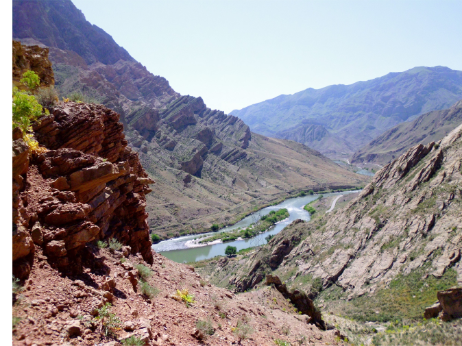

I am a research fellow at the University of Leeds. Recently, I started a postdoctoral research project, under the title: A PHase-Specific geochemical study of marine PRoductivity and nutrient cycling during the end-Permian mass extinction (PHoSPhoR), funded by the Deutsche Forschungsgemeinshaft (DFG).

**New publication online!**

Martin Schobben, Alan Stebbins, Thomas J. Algeo, Harald Strauss, Lucyna Leda, János Haas, Ulrich Struck, Dieter Korn, Christoph Korte, Volatile earliest Triassic sulfur cycle: A consequence of persistent low seawater sulfate concentrations and a high sulfur cycle turnover rate?, Palaeogeography, Palaeoclimatology, Palaeoecology, Available online 22 February 2017, ISSN 0031-0182, (<http://dx.doi.org/10.1016/j.palaeo.2017.02.025>).

PDF available on request.

 
 

The Permian--Triassic boundary section at Aras Valley (NW Iran) on the foreground, the river Aras (or Araxes)
which is the border between Azerbaijan and Iran. In the background one can see the Dorasham 2 section on Azerbaijan territory. 

